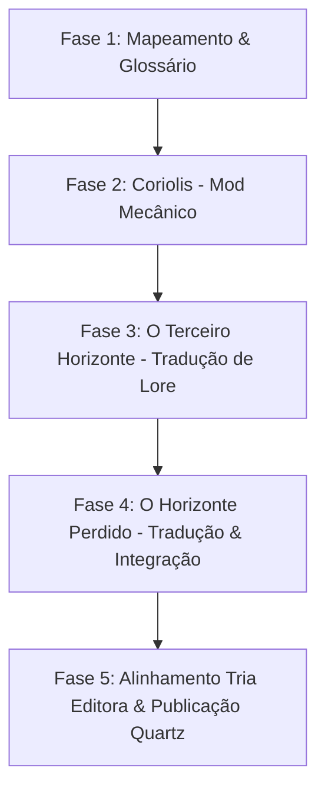

# Visão Geral do Projeto: Coriolis Unificado & Tradução PT-BR

> **Documento de Escopo, Arquitetura e Planejamento**  
> *Este documento serve como referência rápida para o agente de IA e colaboradores compreenderem a visão do projeto, a estrutura dos cenários e o plano de unificação mecânica e tradução.*

---

## 1. Visão Geral e Estrutura Fundamental

O objetivo principal deste projeto é criar uma **edição unificada e traduzida (PT-BR)** do RPG *Coriolis*, integrando o cenário clássico de Space Opera com o novo cenário de exploração e sobrevivência, sob uma espinha dorsal mecânica moderna e consistente baseada na *Year Zero Engine*.

A estrutura do projeto é rigorosamente dividida em três pilares principais:

```
                          ┌──────────────────────────┐
                          │    Coriolis (Sistema)    │
                          │   Mecânica Unificada YZE │
                          └────────────┬─────────────┘
                                       │
                  ┌────────────────────┴────────────────────┐
                  ▼                                         ▼
   ┌─────────────────────────────┐           ┌─────────────────────────────┐
   │    O Terceiro Horizonte     │           │    O Horizonte Perdido      │
   │          (Cenário)          │           │   (A Grande Escuridão)      │
   │    Space Opera & Factions   │           │ Exploração, Ruínas & Bioma  │
   └─────────────────────────────┘           └─────────────────────────────┘
```

---

## 2. Divisão Modular dos Componentes

### 2.1. Coriolis (Sistema)
Contém a **regras de jogo unificadas** que fundem a mecânica clássica do *Terceiro Horizonte* com as melhorias modernas de *A Grande Escuridão*.

* **Espinha Dorsal (Year Zero Engine - YZE):**
  * Rolagem de pilha de dados $d6$ (sucesso em 6s).
  * Mecânica de **Empurrar a Rolagem** (*Pushing the roll*).
  * **Economia de Recursos & Tensão:** Unificação do conceito de *Pontos de Escuridão* (Darkness Points / DP) do Mestre com o sistema de *Estresse / Esperança / Ruína* da nova edição.
* **Criação & Atributos de Personagem:**
  * Lista unificada de Atributos, Perícias e Talentos (gerais, de facção e de ícones).
  * Origens, Conceitos e Traços de Sobrevivência.
* **Exploração & Sobrevivência (*Delving & Expeditions*):**
  * Regras de expedição em ambientes hostis, hazards, gestão de suprimentos e oxigênio/trajes.
  * Sistema de escavação e exploração de ruínas (*Dungeon Crawl* espacial).
* **Naves Espaciais & Combate Espacial:**
  * Construção, manutenção, componentes de naves e combate tático espacial (mantido e atualizado do *Terceiro Horizonte*).
* **Combate, Danos e Lesões Críticas:**
  * Tabela de lesões críticas, trauma mental e contaminação/ruína.

---

### 2.2. O Terceiro Horizonte (Cenário)
Focado no cenário clássico de **Space Opera Arábica / Futurismo do Oriente Médio**, política interplanetária e fé nos Ícones.

* **A Estação Coriolis & O Sistema Kua:** O coração geopolítico do Horizonte, o Monólito e as Facções na Estação.
* **Os Ícones & A Fé:** Os Nove Ícones, rituais, orações, santuários e a influência da fé nas viagens e na vida diária.
* **Geopolítica & Facções:**
  * *Primeiros*: Zelotas, Ordem dos Ícones, Liga dos Livreiros, Nomadistas, etc.
  * *Zenitianos*: Consórcio, Frota Zenitiana, Hegemonia, Fundação, etc.
* **Atlas dos Sistemas Estelares:** Kua, Algol, Mira, Zalos, Taoan, Sadaal, etc.
* **A Grande Escuridão no Horizonte:** As primeiras sombras e os mistérios que conectam o Terceiro Horizonte às expedições distantes.

---

### 2.3. O Horizonte Perdido / A Grande Escuridão (Cenário)
Focado na **fronteira desconhecida, exploração de ruínas antigas e sobrevivência visceral**.

* **A Grande Escuridão:** O ambiente de frio extremo, escuridão cósmica e a ausência da proteção dos Ícones tradicionais.
* **Os Construtores & Artefatos:** A arquitetura alienígena ancestral, mistérios dos Anciões, relíquias e biomorphs.
* **Cidades de Fronteira & Expedições:** Postos avançados, corporações de exploração, biomas hostis e a vida no limite da sobrevivência.
* **Ameaças & Criaturas da Escuridão:** Bestas alienígenas, abominações espaciais e os perigos da loucura/contaminação.

---

## 3. Estratégia de Tradução e Glossário PT-BR

Para garantir alta qualidade e facilidade de adaptação futura quando a **Tria Editora** lançar a tradução oficial de *A Grande Escuridão* no Brasil:

1. **Glossário Base Flexível (`dev/glossario-termos.md`):**
   * Manteremos uma tabela de equivalência entre os termos em Inglês (Original Free League), a Tradução Proposta (Nossa) e a Tradução Oficial Tria (A preencher no lançamento).
2. **Separação entre Sistema e Lore:**
   * Termos técnicos da YZE (*Skill*, *Talent*, *Push*, *Darkness Points*, *Stress*, *Armor*) serão padronizados no pilar *Coriolis (Sistema)*.
   * Nomes de Facções, Sistemas, Ícones e Locais serão mantidos no pilar de Cenário correspondente.
3. **Publicação via Quartz (`content/`):**
   * A estrutura de notas usará links internos no formato Obsidian `[[link]]`, facilitando refatorações em massa de terminologia caso a Tria Editora adote traduções diferentes de termos-chave.

---

## 4. Plano de Execução por Fases



### **Fase 1: Mapeamento & Glossário (Atual)**
- [x] Definição de escopo e arquitetura do projeto.
- [ ] Criação do arquivo `dev/glossario-termos.md`.
- [ ] Leitura e fichamento comparativo das regras dos PDFs em `livros/`:
  - `o-terceiro-horizonte.pdf`
  - `a-grande-escuridao.pdf`

### **Fase 2: Coriolis (Sistema) - Mod Mecânico Unificado**
- [ ] Redação do Livro de Regras Unificado (YZE Coriolis Mod).
- [ ] Harmonização de rolagem, empurrar, Estresse e Pontos de Escuridão.
- [ ] Consolidação de Perícias, Atributos e Talentos.
- [ ] Sistema de Exploração de Ruínas (*Delving*) + Combate de Naves Espaciais.

### **Fase 3: O Terceiro Horizonte (Cenário)**
- [ ] Tradução e estruturação do cenário de *Space Opera*.
- [ ] Documentação das Facções, Ícones, Estação Coriolis e Sistemas Estelares.
- [ ] Integração dos ganchos de aventura que levam ao Horizonte Perdido.

### **Fase 4: O Horizonte Perdido / A Grande Escuridão (Cenário)**
- [ ] Tradução do cenário de exploração, biomas e sobrevivência.
- [ ] Documentação dos Construtores, Relíquias e Regras de Expedição.

### **Fase 5: Alinhamento Oficial & Lançamento Quartz**
- [ ] Adquisição da versão oficial da Tria Editora quando lançada.
- [ ] Atualização do Glossário e remapeamento de termos nas páginas do Quartz.
- [ ] Publicação final do site/compêndio digital.

---

> *Este documento deve ser atualizado sempre que novas decisões de design ou mecânica forem tomadas.*
